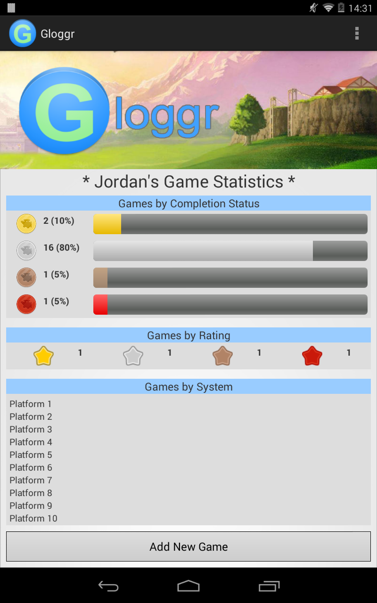
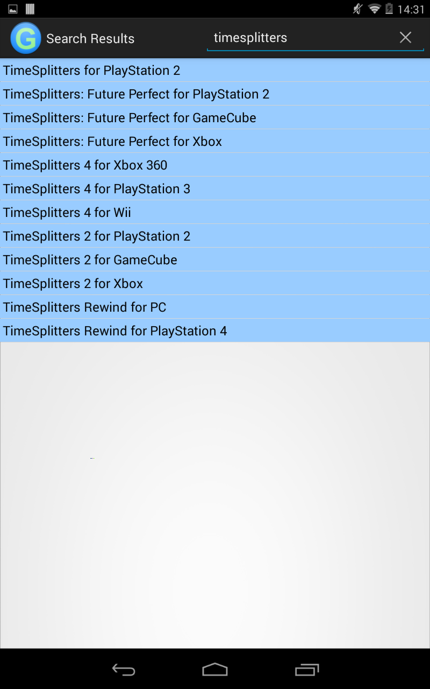

Gloggr
======

Android app which will one day assist with managing and organising your video game backlog (hopefully).

It's very (literally very) early stages right now, but I am trying to add various bits and bobs on a daily basis.

Here is a few important facts about the application:
- It's built to target Android 4.3 minimum
- Mainly tested on my own Nexus 7 device
- It will use the Giant Bomb API to provide game search feature, and also to automatically fill in game details

Here is a few screenshots of the app so far, which will be updated as the app progresses:
Home Activity - 

Search Activity - 

